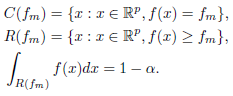
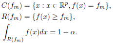

# Publications
This repository provides easy access to my publications and provides errata.
## Selected publications
* A.F. Haselsteiner, J. Lemkuhl, T. Pape, K.-L. Windmeier, K.-D. Thoben: 
ViroCon: A software to compute multivariate extremes using the environmental contour method. 
Accepted by SoftwareX. [(accepted manuscript)](https://github.com/ahaselsteiner/publications/blob/master/2018-10-25_SoftwareX_ViroCon_revised.pdf)
* A.F. Haselsteiner, J.-H. Ohlendorf, S. Oelker, L. Ströer, K.-D. Thoben, K. Wiedemann, E. De Ridder, S. Lehmann: 
Lifting wind turbine components from a floating vessel: A review on current solutions and open problems. 
Accepted by Journal of Offshore Mechanics and Artic Engineering. [(accepted manuscript)](https://doi.org/10.1115/1.4042385)

## Errata
* A.F. Haselsteiner, J.-H. Ohlendorf, W. Wosniok, K.-D. Thoben (2017): Deriving environmental contours from highest density regions. [Coastal Engineering](https://doi.org/10.1016/j.coastaleng.2017.03.002) 123, 42-51. 
  * Expression 9 should be  
  
instead of  
  
